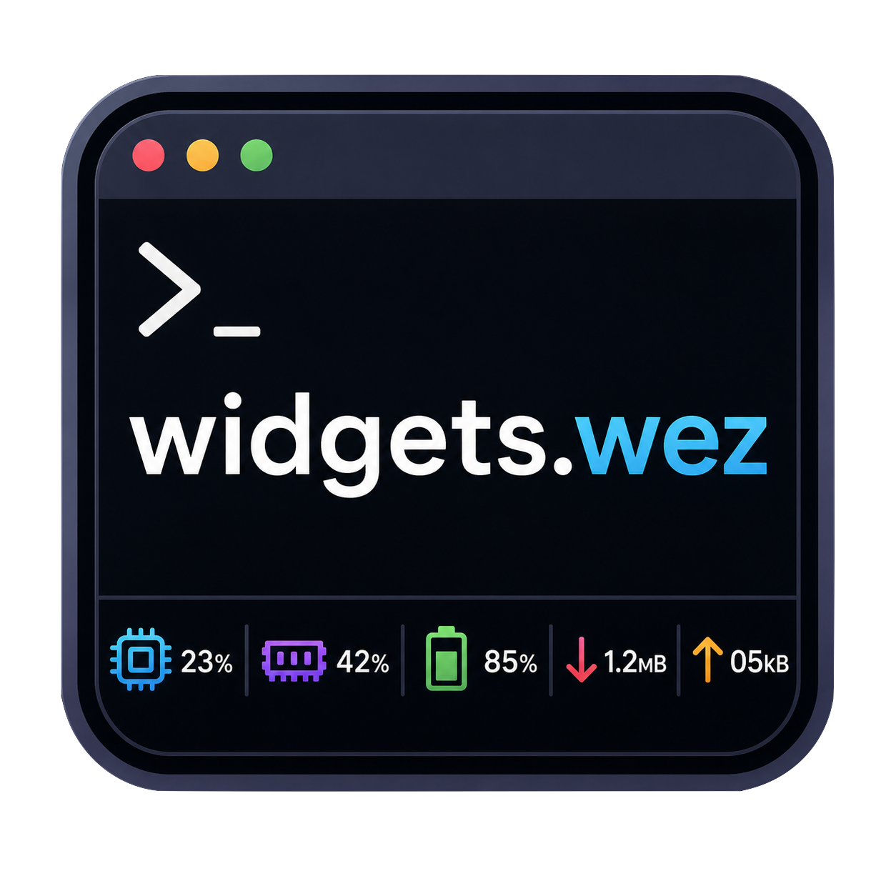
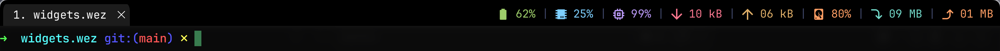

<div align="center">
  

  <h1>widgets.wez</h1>

  <p><strong>Cross-platform status bar widgets for WezTerm.</strong><br/>
  CPU, RAM, battery, network, and disk — ready to render, ready to compose.</p>

  <p>
    
    
    <a href="https://scorecard.dev/status/github.com/usrivastava92/widgets.wez"></a>
  </p>
</div>

---

## Overview

widgets.wez provides ready-to-use status bar widgets for WezTerm. Every widget is cross-platform, gracefully degrades on failure, and composes with native status areas and third-party plugins like [tabline.wez](https://github.com/michaelbrusegard/tabline.wez).

- **Eight widgets** — CPU, RAM, battery, network download/upload, disk space, disk read/write
- **Cross-platform** — macOS, Linux, and Windows with platform-native data sources
- **Degrades gracefully** — failures produce fallback values (`--%`, `00 kB`), never crashes
- **Composable** — use with `apply_to_config`, manual handlers, or `tabline.wez` sections
- **Efficient** — conservative throttling (2–30 s), shared samples between paired widgets

---

## Screenshots

<div align="center">
  <table width="100%">
    <tr>
      <td align="center" width="100%">
        
        <br />
        <sub><strong>Left status placement</strong></sub>
      </td>
    </tr>
    <tr>
      <td align="center" width="100%">
        
        <br />
        <sub><strong>Right status placement</strong></sub>
      </td>
    </tr>
  </table>
</div>

---

## Widgets

| Widget | API | Throttle | Fallback |
|--------|-----|----------|----------|
| CPU | `sys.cpu.utilization.widget(opts)` | 3 s | `--%` |
| RAM | `sys.ram.utilization.widget(opts)` | 3 s | `--%` |
| Battery | `sys.battery.charge.widget(opts)` | 5 s | `--%` |
| Network ↓ | `sys.network.download.widget(opts)` | 2 s | `00 kB` |
| Network ↑ | `sys.network.upload.widget(opts)` | 2 s | `00 kB` |
| Disk space | `sys.disk.space.widget(opts)` | 30 s | `--%` |
| Disk read | `sys.disk.read.widget(opts)` | 3 s | `00 kB` |
| Disk write | `sys.disk.write.widget(opts)` | 3 s | `00 kB` |

```lua
-- Example status bar output:
  85% |  23% |  42% |  ↧ 1.2 MB |  ↥ 05 kB
```

---

## Installation

Add to your `wezterm.lua`:

```lua
local sys = wezterm.plugin.require("https://github.com/usrivastava92/widgets.wez")
```

### Updating

WezTerm caches plugins locally and does **not** auto-update them. After pulling new changes from GitHub, run this from the WezTerm debug overlay (<kbd>Ctrl+Shift+L</kbd> → type the command):

```lua
wezterm.plugin.update_all()
```

Then restart WezTerm (or reload your config with `wezterm.reload_configuration()`).

To pin a specific version (recommended for stability):

```lua
-- Pin to a git tag:
local sys = wezterm.plugin.require("https://github.com/usrivastava92/widgets.wez", { tag = "v1.0.0" })

-- Pin to a specific branch:
local sys = wezterm.plugin.require("https://github.com/usrivastava92/widgets.wez", { ref = "main" })
```

#### Local development (file URL)

```lua
-- Ensure package.path can resolve plugin/systems/init.lua, then:
package.path = "<path-to-widgets.wez>/plugin/?.lua;" .. package.path
local sys = require("systems.init")
```

> **Requirement:** macOS, Linux, or Windows. Your terminal font should include Nerd Font symbols for widget icons, or override with `icon = false` on individual widgets.

---

## Quick Start

Drop this into your `wezterm.lua` for instant status bar widgets:

```lua
local sys = wezterm.plugin.require("https://github.com/usrivastava92/widgets.wez")

sys.apply_to_config(config, {
  right = {
    sys.battery.charge.widget(),
    sys.cpu.utilization.widget(),
    sys.ram.utilization.widget(),
    sys.network.download.widget(),
    sys.network.upload.widget(),
  },
  separator = { text = "|", color = "#3b4261" },
})
```

`apply_to_config` handles the `update-status` handler, widget rendering, and separator placement. Empty `left`/`right` arrays are valid; if both are empty, no handler is installed.

---

## Widget Options

Every widget accepts the same options shape:

| Option | Type | Default | Description |
|--------|------|---------|-------------|
| `icon` | `string \| false` | (per widget) | Nerd Font glyph or `false` to hide |
| `color` | `string` | (per widget) | Foreground hex color |
| `throttle` | `number` | (per widget) | Minimum seconds between refreshes |

```lua
sys.cpu.utilization.widget({ icon = false, color = "#ff0000", throttle = 5 })
-- Renders a bare value: " 23%"
```

**Default colors:**

| Widget | Color |
|--------|-------|
| Battery | `#9ece6a` |
| CPU | `#7dcfff` |
| RAM | `#bb9af7` |
| Network ↓ | `#f7768e` |
| Network ↑ | `#e0af68` |
| Disk space | `#ff9e64` |
| Disk read | `#73daca` |
| Disk write | `#ff9e64` |

---

## Widget Object

Every `widget(opts)` call returns a widget object with four members:

| Member | Type | Description |
|--------|------|-------------|
| `widget.get_text()` | `fn() -> string` | Plain value string. Safe as bare function reference. |
| `widget.get_formatted()` | `fn() -> {FormatItem}` | `wezterm.format` table list with foreground color. |
| `widget.opts` | `table` | Resolved options (defaults merged with overrides). |
| `widget.name` | `string` | Stable id: `"cpu.utilization"`, `"ram.utilization"`, etc. |

`get_text()` and `get_formatted()` are **closures** — they require no `self` or `:` syntax:

```lua
local cpu = sys.cpu.utilization.widget()
cpu.get_text()      -- " 23%"
cpu.opts.color      -- "#7dcfff"
cpu.name            -- "cpu.utilization"
```

---

## Usage Modes

### Native Status Bar (recommended)

`apply_to_config` installs an `update-status` handler:

```lua
sys.apply_to_config(config, {
  left  = { sys.cpu.utilization.widget(), sys.ram.utilization.widget() },
  right = { sys.battery.charge.widget() },
  separator = { text = "|", color = "#3b4261" },
})
```

### Manual Handler

Keep full control of the `update-status` handler:

```lua
local cpu = sys.cpu.utilization.widget()
local ram = sys.ram.utilization.widget()

wezterm.on("update-status", function(window, pane)
  window:set_right_status(wezterm.format({
    unpack(cpu.get_formatted()),
    { Text = "|" },
    unpack(ram.get_formatted()),
  }))
end)
```

### tabline.wez Integration

Pass `get_text` closures directly into tabline sections:

```lua
local tabline = wezterm.plugin.require("https://github.com/michaelbrusegard/tabline.wez")

tabline.setup({
  sections = {
    tabline_x = { sys.cpu.utilization.widget().get_text },
    tabline_y = { sys.network.download.widget().get_text },
    tabline_z = { sys.battery.charge.widget().get_text },
  },
})
```

---

## Platform Details

| Widget | macOS | Linux | Windows |
|--------|-------|-------|---------|
| CPU | `top -l 2 -n 0 -s 1` | `/proc/stat` delta | `Get-CimInstance Win32_Processor` |
| RAM | `vm_stat` + `sysctl` | `/proc/meminfo` (`MemAvailable`) | `Get-CimInstance Win32_OperatingSystem` |
| Battery | `wezterm.battery_info()` | same | same |
| Network | `netstat -ibn` per-interface | `/proc/net/dev` per-interface | `netstat -e` system-wide |
| Disk space | `df -g /System/Volumes/Data` | `df -h /` | `Win32_LogicalDisk C:` |
| Disk I/O | `ioreg` block storage counters | `/proc/diskstats` root device counters | `Win32_PerfRawData_PerfDisk_PhysicalDisk` `_Total` counters |

> **Disk I/O note:** Disk read/write widgets are delta-based. The first sample returns `00 kB`; subsequent samples report per-second rates when counters are available.

---

## Performance

- **Throttling** — default intervals from 2 s (network) to 30 s (disk space) minimize command execution.
- **Shared samples** — network download/upload share one platform sample. Disk read/write share one platform sample. No duplicate commands.
- **Global state** — all persistent data is namespaced under `wezterm.GLOBAL.widgets_*` to avoid collisions with other plugins or user code.

---

## Troubleshooting

**Plugin not reflecting latest GitHub changes?**

- WezTerm caches plugins locally. Run `wezterm.plugin.update_all()` from the debug overlay (<kbd>Ctrl+Shift+L</kbd>) to pull the latest version.
- To force a clean re-clone, delete the plugin cache: `rm -rf ~/Library/Application\ Support/wezterm/plugins/` (macOS) or `rm -rf ~/.local/share/wezterm/plugins/` (Linux).
- Consider pinning to a git tag for reproducible installs: `{ tag = "v1.0.0" }`.

**Widgets not appearing?**

- Confirm the plugin is loaded before `return config`.
- Check that `status_update_interval` is set (default: 1000 ms).
- If using local dev, verify `package.path` includes `<path-to-widgets.wez>/plugin/?.lua`.

**Fallback values showing (`--%`, `00 kB`)?**

- Widgets return fallback values on command failure, parse failure, or unsupported platforms.
- Delta-based widgets return fallback on the first sample because there is no prior data for rate calculation. This includes network throughput and disk I/O, plus Linux CPU utilization.

**Icons missing or showing as boxes?**

- Ensure your WezTerm font includes Nerd Font symbols.
- Set `icon = false` on any widget to render bare values without glyphs.

---

## For Developers

```bash
git clone https://github.com/usrivastava92/widgets.wez
# Load from your wezterm.lua with:
# package.path = "<path>/plugin/?.lua;" .. package.path
# local sys = require("systems.init")
```

## License

MIT
